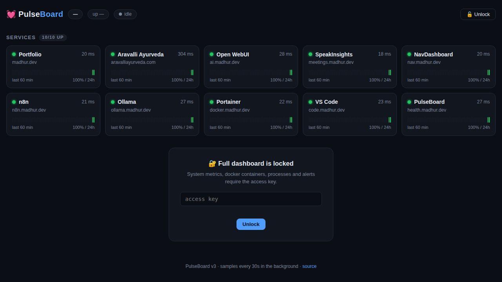
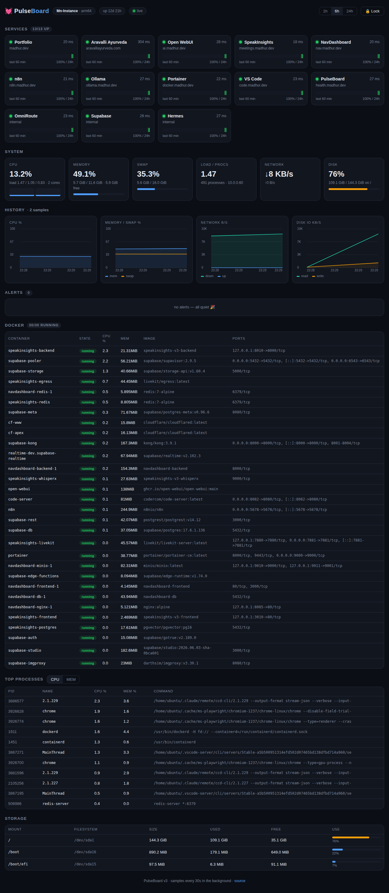

# 💓 PulseBoard

Self-hosted server monitoring dashboard — live at **https://health.madhur.dev**.
Zero npm dependencies: one Node.js file + one HTML file.



## What it does (v3)

- **Public status page** — anyone can see which services are up, latency, and 24h uptime.
  Internal-only services are hidden unless unlocked.
- **Full dashboard behind an access key** — CPU (per-core), memory, swap, load,
  network, disk, docker containers with per-container CPU/mem, top processes, storage.
- **24h history** — a background sampler ticks every 30s into a ring buffer
  (persisted to `data/state.json`, survives restarts) and renders canvas charts
  for CPU, mem/swap, network, and disk IO over 1h/6h/24h.
- **Alert engine → Telegram** — sustained CPU/load, memory ≥92%, swap ≥85%,
  disk ≥85%, service down/recovered (2-strike anti-flap), container stopped/started.
  Alerts go to the in-dashboard feed and to Telegram via `/usr/local/bin/server-alert`,
  with per-rule cooldowns.



## Run

```bash
PULSEBOARD_PORT=8123 PULSEBOARD_HOST=127.0.0.1 node server.js
```

Config via env (or an `EnvironmentFile` in systemd):

| var | meaning |
|---|---|
| `PULSEBOARD_TOKEN` | access key for the full dashboard APIs; unset = everything open |
| `PULSEBOARD_TELEGRAM` | `0` disables Telegram alerts (feed still works) |
| `PULSEBOARD_PORT` / `PULSEBOARD_HOST` | listen address (default `127.0.0.1:8123`) |

Endpoints: `/api/health` and `/api/services` are public; `/api/stats`,
`/api/history?hours=N`, `/api/alerts`, `/api/docker` require the token
(`x-pb-token` header, `Authorization: Bearer`, or `?token=`).

Deployed as a systemd unit (`pulseboard.service`) behind a Cloudflare tunnel.
Edit `SERVICE_CHECKS` in `server.js` to monitor your own services.
